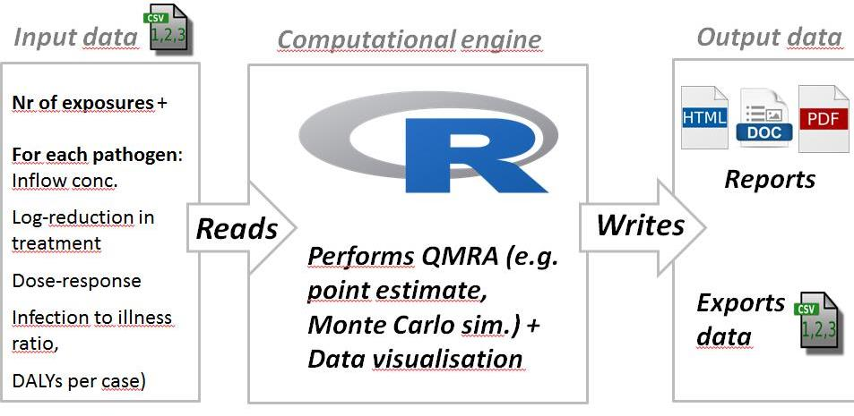
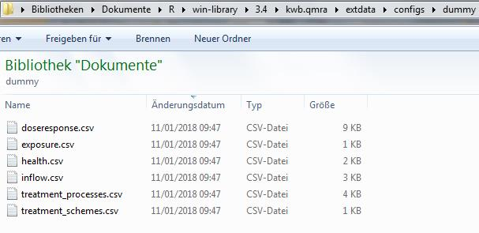

For performing quantitative microbiological risk assessment (QMRA) the open-source R 
package `kwb.qmra` (available at: [Github](https://github.com/kwb-r/kwb.qmra) and [Zenodo](https://doi.org/10.5281/zenodo.154111)) was developed at KWB within the 
[DEMOWARE](http://demoware.eu) project. 

With the `kwb.qmra` package a QMRA was performed for the Old Ford site within the 
DEMOWARE project in order to assesss different wastewater reuse options (for details 
see: [Zenodo](https://doi.org/10.5281/zenodo.159527)). 

The general workflow for using the R package `kwb.qmra` is shown in Fig. 1 below.

The QMRA calculation is based on input data which are stored in six different .CSV configuration files as shown in Fig. 2 below. 

These contain the required information for: 

- **Inflow concentrations** (defined in `inflow.csv`): inflow concentrations (fixed value or 
following a predefined distribution: e.g. min/max values in case of uniform distribution). 
Inflow concentrations need to be defined for all pathogens that should be used for QMRA.

- **Treatment processes** (defined in `treatment_processes.csv`): for each treatment process 
the log-removals for the three different pathogen groups (i.e. Bacteria, Protozoa, Viruses) 
need to be defined. Again these can be either defined as fixed value or following a used 
defined distribution (e.g. uniform, which requires specifying min/max values). Ranges for 
log-removals can be found for example in [WHO (2011)](http://apps.who.int/iris/bitstream/10665/44584/1/9789241548151_eng.pdf#page=162)

- **Treatment schemes** (defined in `treatment_schemes.csv`): different treatment processes 
(defined in `treatment_processes.csv`) can be combined to treatment schemes (e.g. 
bankfiltration + slow sand filtration). All defined treatment schemes will be considered 
in the QMRA calculation.

- **Exposure scenario** (defined in `exposure.csv`): i.e. the number of exposures 
per year and the ingested volume per event, which can be defined as fixed value or 
by following a predefined distribution (e.g. uniform, triangle). In case of a  
Monte-Carlo simulation the number of random distribution generations can be specified 
here also.

- **Dose-response modelling** (defined in `doseresponse.csv`): the best-fit model (i.e.  
exponential or beta-poisson) and its parameters for each pathogen are taken from [QMRAwiki (2016)](http://qmrawiki.canr.msu.edu/old/index.php/Quantitative_Microbial_Risk_Assessment_(QMRA)_Wiki).

- **Health parameters** (defined in `health.csv`): for all pathogens to be used for QMRA the 
infection to illness factor and the disability-adjusted life years (DALY) per case need to be 
defined. Values for these parameters can be found for example in [WHO (2011)](http://apps.who.int/iris/bitstream/10665/44584/1/9789241548151_eng.pdf#page=132)

